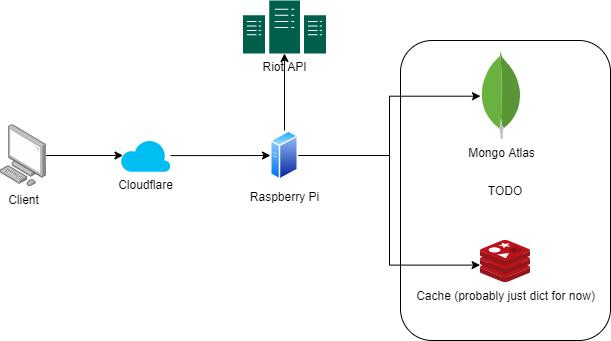

# backend
[](https://codecov.io/gh/mortdogged/backend)
[](https://github.com/psf/black)
<a href="https://gitmoji.dev">
  
</a>



### Installation
```bash
poetry install
poetry run pre-commit install
```

### Test
```bash
poetry run pytest --cov=app --cov-fail-under=80 --cov-report xml
```

### Run
Fill the `.env` file and run:
```
docker-compose up --build
```
