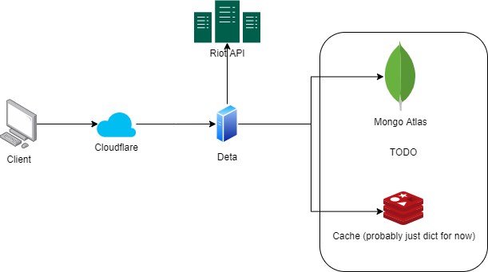

# backend
[](https://codecov.io/gh/mortdogged/backend)
[](https://github.com/psf/black)
<a href="https://gitmoji.dev">
  
</a>

> mortdogged.com isn't endorsed by Riot Games and doesn't reflect the views or opinions of Riot Games or anyone officially involved in producing or managing Riot Games properties. Riot Games, and all associated properties are trademarks or registered trademarks of Riot Games, Inc.



### Installation
```bash
pip install -r requirements-dev.txt
pre-commit install
```

### Test
```bash
pytest --cov=app --cov-fail-under=80 --cov-report xml
```

### Run
Fill the `.env` file and run:
```
python main.py
```

### Build pip-tools
```
pip-compile requirements-dev.in
```
